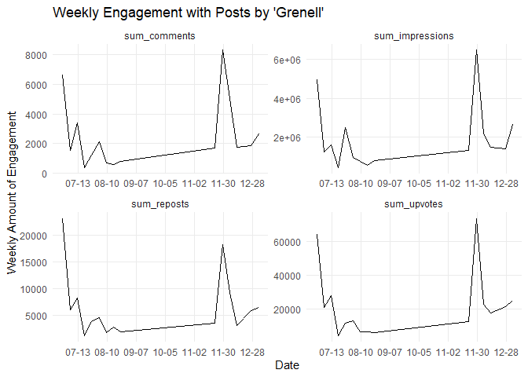
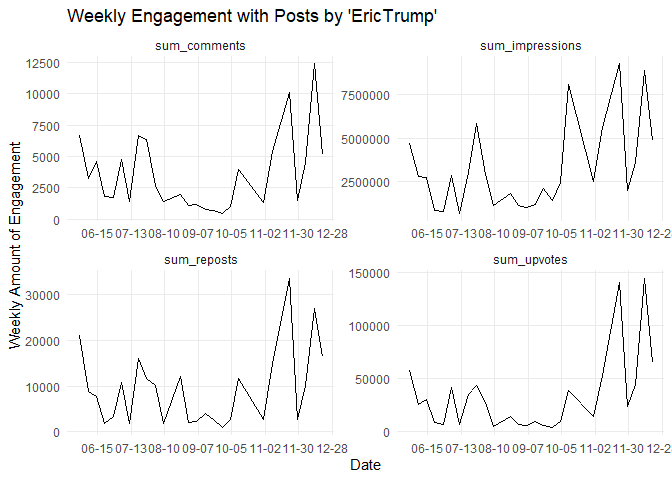
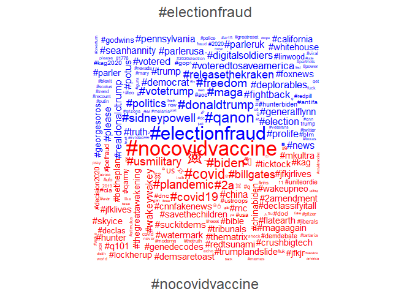

parleR: An R-Interface to Parler.com (backend-credits to
castlelemongrab/parlance)
================
Marcel Schliebs and Dorian Quelle
January 10, 2020

# parleR

<!-- README.md is generated from README.Rmd. Please edit that file -->

<!-- badges: start -->

[](https://www.tidyverse.org/lifecycle/#experimental)
[](https://CRAN.R-project.org/package=ggecon)
<!-- badges: end -->

# Credits and Disclaimers

Disclaimer 1: This package was just before release when Amazon announced
the upcoming shut-down of Parler. While chances are high that this tool
is broken by the time you read this lines, we wanted to get our current
beta version out as quickly as possible to create at least a few hours
of usefulness for the research community. We apologize for any bug you
will be very likely to encounter, but the pending shut-down prevented us
from implementing proper checks and doing extensive beta testing.

Disclaimer 2: This R package is a backend to the node.js based command
line tool `parlance` published here:
<https://github.com/castlelemongrab/parlance/>. We attribute full
credits to the authors of parlance and ask you to equally credit them
when using this package. Similar to the legal notes described here
(<https://github.com/castlelemongrab/parlance#legal>), we do not take
any responsibility for how you use the piece of software. We do not
encouragement the breach of Terms of Service of any company, except in
legally and ethically permitted cases, such as for academic research.
See further the bottom of this document for additional legal notes.
Copyright for Backend: 2020 The Parlance Team Copyright 2020 Baby
Britain, Ltd.

# Pre-Installation Steps and System Requirements

## Installing node.js

To use this software, node.js must be installed. Go to
<https://nodejs.org/en/download/> and select the version designed for
your system. Following the automatic installation of node.js, you can
use parleR.

## Installing parlance

This package is an R implementation of the software Parlance from
<https://github.com/castlelemongrab>. To use it, please install
parlance. Open a terminal window and enter:

``` console
npm install -g @castlelemongrab/parlance
```

To check whether the installation was successful, enter:

``` console
parlance
```

The output should look like this:

``` console
Commands:
  parlance init        Create an authorization file
  parlance feed        Fetch your own feed of posts
  parlance profile     Fetch a user profile
  parlance post        Fetch a single post by identifier
  parlance posts       Fetch all posts for a user
  parlance following   Fetch all users followed by a user
  parlance followers   Fetch all followers of a user
  parlance comments    Fetch all comments for a user, post, or comment
  parlance tags        Fetch all posts mentioning a hashtag
  parlance votes       Fetch all votes made by a user
  parlance write       Post a new message to your account
  parlance delete      Delete an existing message from your account
  parlance follow      Follow a user
  parlance unfollow    Unfollow an already-followed user
  parlance mute        Mute a user
  parlance news        Fetch your own affiliate news feed
  parlance moderation  Fetch your list of comments for moderation

Options:
  --help                 Show help                                     [boolean]
  --version              Show version number                           [boolean]
  --show-hidden          Show hidden options                           [boolean]
  --format-options       Provide format/type-specific options           [string]
  -c, --credentials      MST/JST tokens   [string] [default: "config/auth.json"]
  -o, --credentials-out  Output file for client credentials             [string]
  -S, --start-key        Specify a time-series start/resume key         [string]
  -E, --end-key          Specify a time-series end/halt key             [string]
  -l, --ignore-last      Rely solely upon time comparisons             [boolean]
  -n, --no-delay         Disable the failsafe rate-limiter             [boolean]
  -p, --page-size        Request a specific page size                   [number]
  -d, --debug            Print all debug information to stderr         [boolean]
  -v, --verbose          Print verbose information to stderr           [boolean]
  -q, --quiet            Print less information to stderr              [boolean]
  -s, --silent           Print absolutely no information to stderr     [boolean]
  -e, --expand           Expand specific UUID types     [array] [default: "all"]
  -f, --format           Select output format/type    [string] [default: "json"]
```

## Creating a Parler Profile and Obtaining Cookies

Disclaimer: The end user uses this piece of software at their own legal
responsibility. The authors do not take any responsibility for how you
use the piece of software. We do not encouragement the breach of Terms
of Service of any company, except in legally and ethically permitted
cases.

To use the software you must have a Parler account. After registering,
you need to retrieve the cookies used by Parler. Instructions on how to
extract cookies are given here for Firefox, Safari and Chrome:

### Safari

Right click and select “inspect Element” from the drop down menu. In the
window that pops up, select Storage tab and then click on Cookies. Two
cookies are displayed.

### Chrome

Right-click and select “Inspect”. This will open up the Chrome developer
console. From the developer console, go to the Applications tab, and
then expand the Cookies dropdown under the Storage section. Two cookies
are displayed.

## Authenticating for Parlance via

To use this package, you first must authenticate `within` your
project/working directory. Run the following function, which will write
a file called auth.json into a folder called config. The file will have
the format {“mst” : “s:……..”, “jst” : “…..”}.

``` r
parler_auth(decode = TRUE,
            path = "config/auth.json",#DO NOT CHANGE
            option = "enter")
```

Now you’re ready to go.

# Installation and Loading

``` r
devtools::install_github("schliebs/parleR")
```

``` r
library(parleR)
```

``` r
library(tidyverse)
library(quanteda)
library(lubridate)
```

# Get Posts by Username

``` r
post_df1 <- 
  parler_posts(user = "Grenell",
               output_format = "data.frame",
               flatten_sep = " || ",
               parse_numbers = TRUE,
               verbose = TRUE)
#> [1] "Scraping profile information for 'Grenell'. This might take a while."
```

``` r
colnames(post_df1)
#>  [1] "id1"                      "at"                      
#>  [3] "article"                  "body"                    
#>  [5] "comments"                 "createdAt"               
#>  [7] "creator_id"               "creator_bio"             
#>  [9] "creator_blocked"          "creator_human"           
#> [11] "creator_integration"      "creator_joined"          
#> [13] "creator_name"             "creator_rss"             
#> [15] "creator_private"          "creator_profilePhoto"    
#> [17] "creator_username"         "creator_verified"        
#> [19] "creator_verifiedComments" "creator_"                
#> [21] "creator_score"            "creator_interactions"    
#> [23] "creator_media"            "creator_badges"          
#> [25] "depth"                    "depthRaw"                
#> [27] "hashtags"                 "id"                      
#> [29] "impressions"              "links"                   
#> [31] "preview"                  "reposts"                 
#> [33] "shareLink"                "sensitive"               
#> [35] "state"                    "upvotes"                 
#> [37] "parent"                   "root"
```

``` r
post_df1 %>% 
  dplyr::select(creator_username,body,impressions,upvotes,createdAt)
#> # A tibble: 83 x 5
#>    creator_username body                        impressions upvotes createdAt   
#>    <chr>            <chr>                             <dbl>   <dbl> <chr>       
#>  1 Grenell          "Start following people - ~      245000    6600 2021-01-09T~
#>  2 Grenell          "Start following people - ~      129000    1700 2021-01-09T~
#>  3 Grenell          "I’ll be on with @SeanHann~      299000    2300 2021-01-07T~
#>  4 Grenell          ""                               336000    2500 2021-01-03T~
#>  5 Grenell          ""                               925000    9200 2021-01-03T~
#>  6 Grenell          ""                               907000    9200 2021-01-03T~
#>  7 Grenell          "New year means opening up~      336000    2500 2021-01-01T~
#>  8 Grenell          ""                               148000    1500 2020-12-31T~
#>  9 Grenell          ""                               413000    3900 2020-12-26T~
#> 10 Grenell          "Today I’m thinking of tho~      413000    3900 2020-12-25T~
#> # ... with 73 more rows
```

Plot weekly likes over time

``` r
weekly_engagement <- 
  post_df1 %>% 
  mutate(week = lubridate::round_date(as_datetime(createdAt),"weeks")) %>% 
  group_by(week) %>% 
  summarise(across(.cols = all_of(c("impressions","upvotes",
                          "reposts","comments")),
                   .fns = sum, 
                   .names = "sum_{.col}")) %>% 
  filter(week < as.Date("2021-01-10"))
```

``` r
ggplot(weekly_engagement %>% gather(var,val,-week)) + 
  geom_line(aes(x = week,y = val)) + 
  facet_wrap(~var,ncol = 2,scales = "free") + 
  theme_minimal() + 
  scale_x_datetime(date_breaks = "4 weeks",
                   date_labels = "%m-%d") + 
  theme(panel.grid.minor = element_blank()) + 
  labs(title = "Weekly Engagement with Posts by 'Grenell'",
       x = "Date",
       y = "Weekly Amount of Engagement")
```



Same for ‘EricTrump’ (no idea if account is legit):

``` r
post_df2 <- 
  parler_posts(user = "EricTrump",
               output_format = "data.frame",
               flatten_sep = " || ",
               parse_numbers = TRUE,
               verbose = TRUE)
#> [1] "Scraping profile information for 'EricTrump'. This might take a while."
```

``` r
post_df2 %>% 
  dplyr::select(creator_username,body,impressions,upvotes,createdAt)
#> # A tibble: 71 x 5
#>    creator_username body                        impressions upvotes createdAt   
#>    <chr>            <chr>                             <dbl>   <dbl> <chr>       
#>  1 EricTrump        ""                             3800000    96000 2021-01-09T~
#>  2 EricTrump        "Hello Friends!!! \U0001f1~    4100000.   68000 2021-01-09T~
#>  3 EricTrump        "Congratulations to @Trump~    2700000    15000 2020-12-18T~
#>  4 EricTrump        ""                             2200000    50000 2020-12-17T~
#>  5 EricTrump        "Just chilling with Grandp~    2500000    64000 2020-12-16T~
#>  6 EricTrump        "When you rearrange the sh~    2400000    32000 2020-12-12T~
#>  7 EricTrump        "The shooting sports were ~    2200000    31000 2020-12-09T~
#>  8 EricTrump        "Proud of @LaraleaTrump!!"     1800000    18000 2020-12-09T~
#>  9 EricTrump        ""                             2200000    30000 2020-12-08T~
#> 10 EricTrump        "Happy Saturday Friends!"      1400000    15000 2020-12-05T~
#> # ... with 61 more rows
```

Plot weekly likes over time

``` r
weekly_engagement <- 
  post_df2 %>% 
  mutate(week = lubridate::round_date(as_datetime(createdAt),"weeks")) %>% 
  group_by(week) %>% 
  summarise(across(.cols = all_of(c("impressions","upvotes",
                          "reposts","comments")),
                   .fns = sum, 
                   .names = "sum_{.col}")) %>% 
  filter(week < as.Date("2021-01-10"))
```

``` r
ggplot(weekly_engagement %>% gather(var,val,-week)) + 
  geom_line(aes(x = week,y = val)) + 
  facet_wrap(~var,ncol = 2,scales = "free") + 
  theme_minimal() + 
  scale_x_datetime(date_breaks = "4 weeks",
                   date_labels = "%m-%d") + 
  theme(panel.grid.minor = element_blank()) + 
  labs(title = "Weekly Engagement with Posts by 'EricTrump'",
       x = "Date",
       y = "Weekly Amount of Engagement")
```



# Get all Posts with a certain Hashtag

Because there are thousands of posts, we time out the request after a
certain amount of seconds.

``` r
hashtag_posts_df1 <- 
  parler_hashtag(hashtag = "maga",
                 output_format = "data.frame",
                 flatten_sep = " || ",
                 parse_numbers = TRUE,
                 verbose = TRUE,
                 timeout = 60)
#> [1] "Scraping Parley including hashtag '#maga'. This might take a while."
```

``` r
colnames(hashtag_posts_df1)
#>  [1] "id1"                      "at"                      
#>  [3] "article"                  "body"                    
#>  [5] "comments"                 "createdAt"               
#>  [7] "creator_id"               "creator_bio"             
#>  [9] "creator_blocked"          "creator_human"           
#> [11] "creator_integration"      "creator_joined"          
#> [13] "creator_name"             "creator_rss"             
#> [15] "creator_private"          "creator_profilePhoto"    
#> [17] "creator_username"         "creator_verified"        
#> [19] "creator_verifiedComments" "creator_score"           
#> [21] "creator_interactions"     "creator_state"           
#> [23] "creator_media"            "creator_badges"          
#> [25] "depth"                    "depthRaw"                
#> [27] "hashtags"                 "id"                      
#> [29] "impressions"              "links"                   
#> [31] "preview"                  "reposts"                 
#> [33] "shareLink"                "sensitive"               
#> [35] "state"                    "upvotes"                 
#> [37] "creator_coverPhoto"       "parent"                  
#> [39] "root"                     "creator_"
```

``` r
hashtag_posts_df1 %>% 
  head(50) %>% 
  dplyr::select(creator_username,body,impressions,upvotes,createdAt)
#> # A tibble: 50 x 5
#>    creator_username body                        impressions upvotes createdAt   
#>    <chr>            <chr>                             <dbl>   <dbl> <chr>       
#>  1 Ivanka2020       "Hey Republicans,\n\nTrump~         351       4 2021-01-10T~
#>  2 Areebanaseem113  "#FightForTrump #TRUMP2020~         961       8 2021-01-10T~
#>  3 Slime83          "#SlimeMoldParler says FUC~         307       1 2021-01-10T~
#>  4 MartyLevine      "If “Amazon” is jumping in~          50       1 2021-01-10T~
#>  5 TrumpTrainTeam   "#stopthesteal #VoterFraud~         838      19 2021-01-10T~
#>  6 WarrenPeace310   "Pence is a traitor and al~         440       4 2021-01-10T~
#>  7 Hikkijorza       "Election Update: Trump Le~         716       4 2021-01-10T~
#>  8 Gayslime         "#SlimeMoldParler says FUC~         303       1 2021-01-10T~
#>  9 PATRIOTGANGSTER  "When you point your finge~         314       5 2021-01-10T~
#> 10 Doggoslime       "#SlimeMoldParler says FUC~         446       1 2021-01-10T~
#> # ... with 40 more rows
```

## Compare Key Words from two different hashtags

To be honest, this application does not really carry a lot of meaning,
we just ran out of time before parler gets shut down and therefore opted
for a quick and dirty comparison cloud.

Scrape hashtags ‘\#nocovidvaccine’ and ‘\#electionfraud’

``` r
vaxx_hashtags <- 
  parler_hashtag(hashtag = "nocovidvaccine",
                 output_format = "data.frame",
                 flatten_sep = " || ",
                 parse_numbers = TRUE,
                 verbose = F,
                 timeout = 30) %>% 
  mutate(ht = "#nocovidvaccine")

electionfraud_hashtags <- 
  parler_hashtag(hashtag = "electionfraud",
                 output_format = "data.frame",
                 flatten_sep = " || ",
                 parse_numbers = TRUE,
                 verbose = F,
                 timeout = 30) %>% 
  mutate(ht = "#electionfraud")
```

Wordcloud:

``` r
both <- bind_rows(vaxx_hashtags,electionfraud_hashtags)

corpus <- quanteda::corpus(both %>% rename(text = body))

dfmat <- dfm(corpus_subset(corpus, 
                            ht %in% c("#electionfraud", "#nocovidvaccine")),
              remove = stopwords("english"), 
              remove_punct = TRUE, 
              groups = "ht") %>%
    dfm_trim(min_termfreq = 3)
```

## Frequent Hashtags co-occuring with ‘electionfraud’ and ‘nocovidvaccine’

``` r
textplot_wordcloud(dfmat, 
                   min_size = 0.5,
                   max_size = 3,
                   comparison = TRUE, 
                   max_words = 1000,
                   color = c("blue", "red"))
```



# Get User Profile Data

## R data.frame (nested variables flattened)

``` r
out <-
  parler_profile(user = "caseybmulligan",
                 output_format = "data.frame",
                 flatten_sep = " || ",
                 token_variables = F,
                 parse_numbers = TRUE,
                 verbose = TRUE)
#> [1] "Scraping profile information for caseybmulligan"
#> Warning: Flattened variable 'badges' of length 2 with separator ' || '
```

``` r
colnames(out)
#>  [1] "accountColor"     "bio"              "blocked"          "coverPhoto"      
#>  [5] "human"            "id"               "integration"      "joined"          
#>  [9] "name"             "private"          "profilePhoto"     "rss"             
#> [13] "username"         "verified"         "verifiedComments" "badges"          
#> [17] "score"            "interactions"     "state"            "banned"          
#> [21] "comments"         "followers"        "following"        "likes"           
#> [25] "posts"            "media"
```

``` r
out %>% 
  select(name,username,followers,likes,posts,joined,bio)
#> # A tibble: 1 x 7
#>   name      username   followers likes posts joined    bio                      
#>   <chr>     <chr>          <dbl> <dbl> <chr> <chr>     <chr>                    
#> 1 Casey B.~ caseybmul~    121000   126 261   2020-10-~ "You're Hired! Untold Su~
```

## Without Token-associated variables

``` r
out2 <-
  parler_profile(user = "caseybmulligan",
                 output_format = "data.frame",
                 flatten_sep = " || ",
                 token_variables = TRUE,
                 parse_numbers = TRUE,
                 verbose = TRUE)
#> [1] "Scraping profile information for caseybmulligan"
#> Warning: Flattened variable 'badges' of length 2 with separator ' || '
```

``` r
colnames(out2)
#>  [1] "accountColor"     "bio"              "blocked"          "coverPhoto"      
#>  [5] "followed"         "human"            "id"               "integration"     
#>  [9] "joined"           "name"             "muted"            "pendingFollow"   
#> [13] "private"          "profilePhoto"     "rss"              "username"        
#> [17] "verified"         "verifiedComments" "badges"           "score"           
#> [21] "interactions"     "state"            "banned"           "isFollowingYou"  
#> [25] "comments"         "followers"        "following"        "likes"           
#> [29] "posts"            "media"
```

New colnames which are only outputtet if `token_variables == TRUE`:

``` r
colnames(out2) %>% .[!. %in% colnames(out)]
#> [1] "followed"       "muted"          "pendingFollow"  "isFollowingYou"
```

## JSON List Object

``` r
jlist <- 
  parler_profile(user = "caseybmulligan",
                 output_format = "list",
                 flatten_sep = " || ",
                 verbose = FALSE)
```

``` r
str(jlist)
#> List of 31
#>  $ _id             : chr "ccab997e08254afe9231c35857f95d81"
#>  $ accountColor    : chr "#4aa046"
#>  $ bio             : chr "You're Hired! Untold Successes and Failures of a Populist President. yourehiredtrump.com \"Profound, important,"| __truncated__
#>  $ blocked         : logi FALSE
#>  $ coverPhoto      : chr "1ff7f29dc2134ab0828d0a090c607711"
#>  $ followed        : logi FALSE
#>  $ human           : logi TRUE
#>  $ id              : chr "ccab997e08254afe9231c35857f95d81"
#>  $ integration     : logi FALSE
#>  $ joined          : chr "20201015232824"
#>  $ name            : chr "Casey B. Mulligan"
#>  $ muted           : logi FALSE
#>  $ pendingFollow   : logi FALSE
#>  $ private         : logi FALSE
#>  $ profilePhoto    : chr "bae299d65951425d8a2e3daa8a1d540b"
#>  $ rss             : logi FALSE
#>  $ username        : chr "caseybmulligan"
#>  $ verified        : logi TRUE
#>  $ verifiedComments: logi FALSE
#>  $ badges          :List of 2
#>   ..$ : int 1
#>   ..$ : int 0
#>  $ score           : chr "45k"
#>  $ interactions    : int 259
#>  $ state           : int 1
#>  $ banned          : logi FALSE
#>  $ isFollowingYou  : logi FALSE
#>  $ comments        : chr "50"
#>  $ followers       : chr "121k"
#>  $ following       : chr "61"
#>  $ likes           : chr "126"
#>  $ posts           : chr "261"
#>  $ media           : chr "27"
```

## Multiple Users

``` r
user_vec <- c("Marklevinshow","SeanHannity","Devinnunes","GovernorNoem",
              "KTHopkins","Westmonster","TommyRobinson")

out_df <- 
  purrr::map(.x = user_vec,
           .f = ~ 
             parler_profile(user = .x,
                            output_format = "data.frame",
                            flatten_sep = " || ",
                            token_variables = FALSE,
                            parse_numbers = TRUE,
                            verbose = FALSE)
           ) %>% 
  bind_rows()
#> Warning: Outer names are only allowed for unnamed scalar atomic inputs
#> New names:
#> * `` -> ...19
#> Warning: Outer names are only allowed for unnamed scalar atomic inputs
#> New names:
#> * `` -> ...20
#> Warning: Outer names are only allowed for unnamed scalar atomic inputs
#> New names:
#> * `` -> ...21
#> Warning: Outer names are only allowed for unnamed scalar atomic inputs
#> New names:
#> * `` -> ...20
#> New names:
#> * ...19 -> ...15
#> New names:
#> * ...20 -> ...16
#> New names:
#> * ...21 -> ...16
#> New names:
#> * ...20 -> ...16
```

``` r
out_df %>% 
    select(name,username,followers,likes,posts,joined,bio)
#> # A tibble: 7 x 7
#>   name      username   followers likes posts joined    bio                      
#>   <chr>     <chr>          <dbl> <dbl> <chr> <chr>     <chr>                    
#> 1 Mark Lev~ Marklevin~   4900000     0 3.5k  2019-06-~ "THIS IS THE OFFICIAL MA~
#> 2 Sean Han~ SeanHanni~   7600000     0 2.5k  2020-06-~ "TV Host Fox News Channe~
#> 3 Devin Nu~ Devinnunes   2900000   528 1.7k  2020-02-~  <NA>                    
#> 4 Gov. Kri~ GovernorN~    798000     0 40    2020-11-~ "South Dakotan. Wife. Mo~
#> 5 Katie Ho~ KTHopkins     473000     8 1.3k  2020-06-~ "the Biggest Bitch in Br~
#> 6 Westmons~ Westmonst~    149000     0 1.4k  2020-06-~ "WESTMONSTER.COM - News ~
#> 7 Tommy Ro~ TommyRobi~    363000    94 6.8k  2019-06-~ "I’m back \n\nhttps://ww~
```

# Legal Remarks and Credits:

This package is a mere R-frontend wrapper to the backend provided by
parlance (<https://github.com/castlelemongrab/parlance>). As your
machine will be calling ‘parlance’ to scrape data, we emphatically
repeat the legal nodes by the authors of parlance in this place. You can
find them here: <https://github.com/castlelemongrab/parlance#legal>

QUOTE: "This repository seeks to document the design of Parler as
accurately and concisely as possible. Parler is of interest to
researchers, political campaigns, civic engagement groups, law
enforcement, anti-discrimination groups, and the public at large. The
free speech conveyed in this repository is of timely and widespread
public interest.

If you choose to use this speech as part of an activity, please ensure
your activity is ethical and legal within your jurisdiction. The author
of this work of speech cannot, will not, and has no responsibility to
control the behavior of others – in any jurisdiction, on any of
Jupiter’s mighty moons, or anywhere within the known universe – past,
present, or future.

Due to the specific nature and quality of Parler’s engineering design,
the speech contained within this repository is the sole product of
unrelated industry experience and third-party documentation. No act of
disassembly, decompilation, reverse engineering, trade secret violation
– nor any other prohibited act – was necessary to create the work
contained herein.

“Communication does not lose constitutional protection as ‘speech’
simply because it is expressed in the language of computer code.
Mathematical formulae and musical scores are written in ‘code,’
i.e. symbolic notations not comprehensible to the uninitiated, and yet
both are covered by the First Amendment. If someone chose to write a
novel entirely in computer object code by using strings of 1’s and 0’s
for each letter of each word, the resulting work would be no different
for constitutional purposes than if it had been written in English.” –
DMCA, Universal City Studios v. Corley, FN191: 273 F.3d 429, 60 USPQ2d
1953 (2nd Cir. 2001)

Congress shall make no law respecting an establishment of religion, or
prohibiting the free exercise thereof; or abridging the freedom of
speech, or of the press; or the right of the people peaceably to
assemble, and to petition the Government for a redress of grievances. "

Copyright for Backend: 2020 The Parlance Team Copyright 2020 Baby
Britain, Ltd.

License Statement for Parlance Backend: THE SOFTWARE IS PROVIDED “AS
IS”, WITHOUT WARRANTY OF ANY KIND, EXPRESS OR IMPLIED, INCLUDING BUT
NOT LIMITED TO THE WARRANTIES OF MERCHANTABILITY, FITNESS FOR A
PARTICULAR PURPOSE AND NONINFRINGEMENT. IN NO EVENT SHALL THE AUTHORS OR
COPYRIGHT HOLDERS BE LIABLE FOR ANY CLAIM, DAMAGES OR OTHER LIABILITY,
WHETHER IN AN ACTION OF CONTRACT, TORT OR OTHERWISE, ARISING FROM, OUT
OF OR IN CONNECTION WITH THE SOFTWARE OR THE USE OR OTHER DEALINGS IN
THE SOFTWARE.
